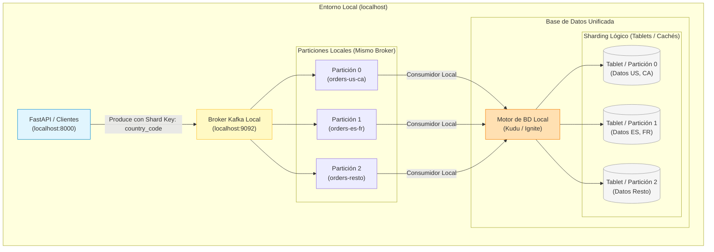

# E-Commerce Triad
Este proyecto hace uso de Apache Kafka, Apache Kudu y Apache Ignite para crear un sistema de E-Commerce. Los datos ingestados serán producidos por un script de Python que simula la actividad de un sitio de E-Commerce, generando datos de ventas, productos, zonas, etc.
Este sistema debe poder clasificar los datos por zonas y precio para así poder filtrar y banear los pedidos de zonas inseguras y con precios sospechosos.


## 1. Topologia de Datos 

### 1.1. **Ingesta**
Un servicio FastAPI (`01_kafka_ingest.py`) recibe pedidos a través de una API REST y los publica en un topic de Kafka llamado `orders`, particionado por `country_code` para garantizar orden por país.

### 1.2. **Procesamiento en caliente**
Un consumidor de Kafka (`02_ignite_fraud.py`) procesa los pedidos en tiempo real, utilizando Apache Ignite para mantener en memoria cachés de países de riesgo y velocidad de compra por usuario. Los pedidos se clasifican como `APPROVED` o `BLOCKED` y se publican en un topic `orders-processed`.

### 1.3. **Almacenamiento en frío**
Otro consumidor (`03_kudu_drain.py`) lee los pedidos aprobados y los almacena en una tabla de Apache Kudu utilizando operaciones `upsert` para garantizar idempotencia.

## 2. Arquitectura del Sistema

### 2.1. **Arquitectura Event-Driven Architecture**

El sistema se construirá sobre Kafka, que se usará como bus de eventos. 
* Desacoplamiento: el productor (API) y el consumidor (Ignite) no se conocen entre sí. 
* Logs: Si el consumidor falla, el mensaje se guarda en Kafka y se puede reintentar. 
* Composibilidad: El sistema es escalable, basta con agregar un nuevo consumidor al topic `orders-processed`. 

### 2.2. Procesamiento HTAP columnar 

Se basa en la arquitectura HTAP o [Lambda](https://www.databricks.com/blog/what-is-lambda-architecture) pero con algunas diferencias. 

Existen dos capas de procesamiento
* **Capa fría** (Batch layer)
Esta se encarga del almacenamiento en Kudu, es almacenamiento "frío" a largo plazo. 

* **Capa caliente** (Speed layer)
Se encarga de ingerir los datos y procesarlos en tiempo real, validando fraudes y aplicando políticas de seguridad.

### 2.3. Apache Kudu
Se hace uso de `upsert` para garantizar idempotencia, los datos se almacenan en formato columnar para facilitar el procesamiento analítico. 
Esto se debe a que en sistemas de streaming como Kafka puede haber reintentos, por lo que se necesita garantizar que los datos no se dupliquen.

### 2.4. Apache Ignite
Se encarga de procesar los datos en tiempo real, validando fraudes y aplicando políticas de seguridad. 
En Ignite se mantienen en memoria cachés de países de riesgo y velocidad de compra por usuario.

### 2.5. Apache Kafka
Este broker de eventos se encarga de actuar como intermediario central, almacenando los mensajes de manera duradera y distribuyéndolos en tiempo real. 
Un `broker` es un servidor que gestiona flujos de datos en tiempo real y desacopla a los productores de los consumidores.

### 2.6. FastAPI
El servidor se encarga de recibir los pedidos a través de una `API REST` y publicarlos en un topic de Kafka llamado `orders`, particionado por `country_code` para garantizar orden por país.
`FastAPI` es un framework de `Python` que permite crear `APIs REST` de manera rápida y sencilla.
`API REST`: Interfaz que permite la comunicación estandarizada entre diferentes programas, aplicaciones o sistemas.

### 2.7. Particionamiento
Se utiliza particionamiento por `country_code` para garantizar orden y localidad de los datos por país.
Un `topic` es un canal de comunicación entre productores y consumidores, donde los mensajes se almacenan en orden cronológico.
El particionamiento se hace para optimizar las consultas y aprovechar la arquitectura distribuida de los motores de bases de datos. 
Ejemplo de Sharding en un Prototipo hecho con `Gemini 3 Flash`:


## 3. Tech Stack — Trinidad E-commerce Pipeline

A continuación, se detalla la justificación de las tecnologías elegidas para nuestro prototipo local, priorizando la facilidad de aprendizaje y la representación fiel de un entorno real.

### 3.1. Capa de Ingesta: FastAPI + Apache Kafka

Se usarán para recibir y transportar los pedidos de manera rápida y segura. FastAPI actuará como la puerta de entrada (API REST) para procesar las peticiones concurrentes, mientras que Kafka funcionará como el bus central de eventos que guarda y ordena temporalmente los mensajes particionándolos por país.

### 3.2. Capa de Procesamiento In-Memory: Apache Ignite

Se usará para procesar los datos en tiempo real de forma ultrarrápida directamente en la memoria RAM. Aquí validaremos fraudes instantáneamente antes de confirmar y persistir la transacción, usando dos herramientas principales:
1. **Caché estática (`risk_countries`):** Una lista negra sencilla que nos permite bloquear al instante compras desde países sospechosos.
2. **Caché dinámica (`user_velocity`):** Un contador temporal que nos ayuda a vigilar cuántas compras intenta hacer un usuario en un minuto, ideal para frenar comportamientos anormales o bots.

### 3.3. Capa de Almacenamiento y Analítica: Apache Kudu

Se usará para guardar los datos aprobados de forma permanente y permitirnos hacer consultas analíticas pesadas sin saturar el sistema. Logra esta tremenda eficiencia organizando los datos en columnas y usando una técnica clave:
* **Sharding Lógico Local:** Básicamente, Kudu divide internamente la información en pequeños pedazos (llamados *tablets*). Esto hace que la carga de datos se reparta mejor y que nuestras consultas (como sumar las ventas de todo un país) fluyan muchísimo más rápido.

### 3.4. Capa de Visualización: Grafana

Se usará para mostrar dashboards gráficos con los resultados obtenidos del sistema, por ejemplo: total de ingresos por país y cantidad de pedidos aprobados vs bloqueados.

### 3.5. Infraestructura de Prototipo Local: Docker Compose

Se usará para levantar todo este ecosistema (Kafka, Ignite, Kudu, Grafana) en un entorno local con un solo comando, evitando configuraciones complejas para que puedas concentrarte puramente en programar y aprender.

### 3.6. Puente de Datos Python ↔ Kudu: PySpark

Para conectar Python con Apache Kudu se utiliza **PySpark 3.5.1** como puente de comunicación, en lugar de compilar las librerías nativas de C++ del cliente oficial de Kudu.

PySpark arranca una **Java Virtual Machine (JVM)** en segundo plano y se comunica con ella mediante el protocolo **Py4J** (un gateway de sockets TCP local). Esto permite que el código Python invoque directamente el conector oficial `kudu-spark3_2.12`, que se descarga automáticamente desde Maven Central la primera vez que se ejecuta el script.

```
Python Script  →  PySpark (Py4J Gateway)  →  JVM  →  kudu-spark3 JAR  →  Kudu Cluster (Docker)
```

**¿Por qué PySpark 3.5.1 específicamente?**
La compatibilidad binaria de Scala es estricta. El conector `kudu-spark3_2.12` requiere un runtime compilado con **Scala 2.12**. PySpark 3.5.x usa Scala 2.12, mientras que PySpark 4.x usa Scala 2.13, lo que produce una ruptura de clases en tiempo de ejecución (`NoClassDefFoundError`).

| Versión PySpark | Scala | Compatible con `kudu-spark3_2.12` |
| :--- | :--- | :---: |
| `3.5.1` (requerida) | 2.12 | Sí |
| `4.x` | 2.13 | No |

**Uso en el pipeline:** PySpark se utiliza exclusivamente en el script `03_kudu_drain.py` (capa fría), no en la capa caliente (Ignite) ni en la ingesta (FastAPI). Su rol es recibir los eventos `APPROVED` del topic `orders-processed` de Kafka y persistirlos de forma idempotente en Kudu mediante `upsert`.
